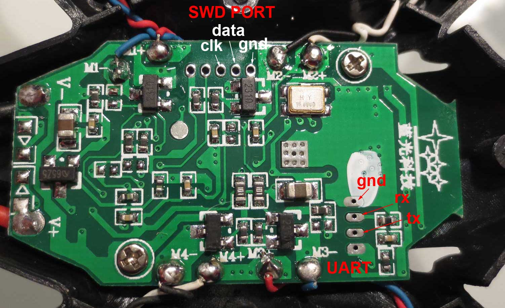
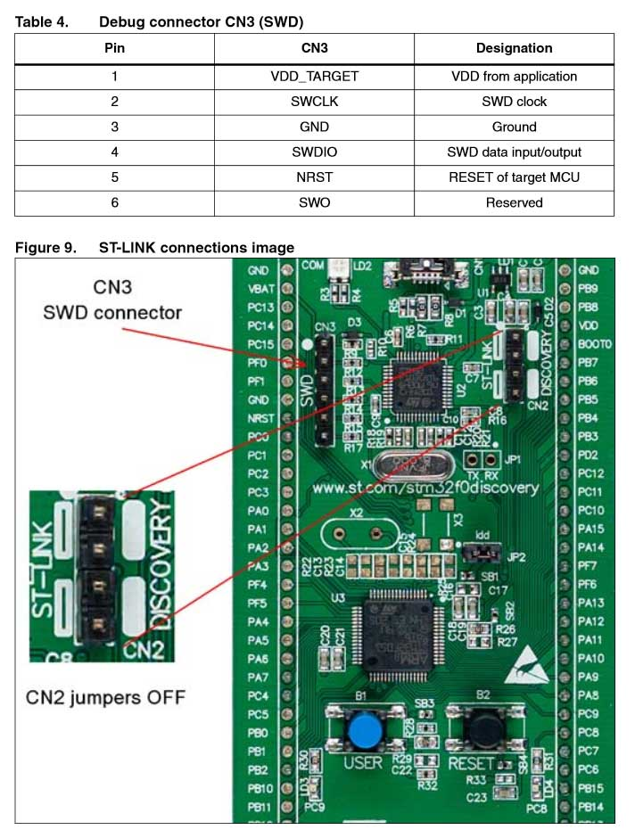
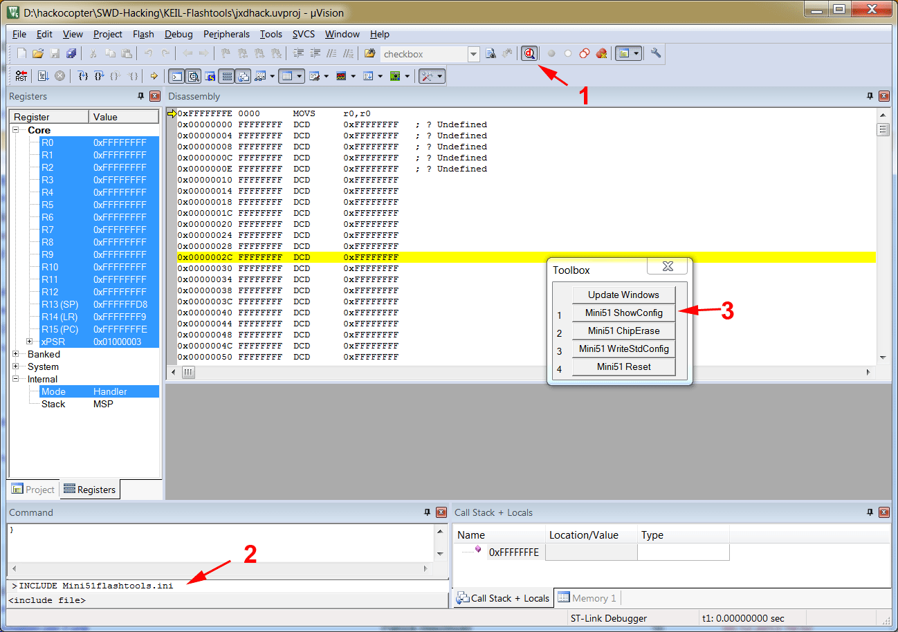

## Hack-O-Copter Firmware flashing ##

The main controller of the JD385 and many other small quadrocopters is a Nuvoton Mini54ZAN, a Cortex-M0 based microcontroller with 16kb of user flash and 2kb of SRAM.

The controller can be accessed through the serial wire debug (SWD) port, which is accessible on the board. Unfortunately it turned out, that the code protection was activated. Therefore it was not possible to read out the existing firmware or to reprogram the device. The only way to deactivate the protection is to perform a chip erase. 

Unfortunately, Nuvoton decided not to publish information about how to perform a chip erase. Officially you need to buy one of their custom SWD adapters, "Nu-Link", to unlock their devices. True to the spirit, the required sequence was reverse engineered from an original programmer - [details linked here](https://github.com/hackocopter/SWD-Hacking). As described below, it is now possible to unlock and reflash the JD385 flight controller with any SWD adapter that is supported by Keil µVision. 

### Requirements ###

Since the controller only has 16kb of flash, it is fully supported by the free evaluation version of Keil µVision. You can find µVision 5 here:

https://www.keil.com/demo/eval/arm.htm

To support the Nuvoton controllers, you also have to install legacy device support:
 
http://www.keil.com/mdk5/legacy

In addition to the software, you also need a SWD adapter that is supported by Keil and the required drivers. The most compatible option is to use Nuvotons original "Nu-Link" which support setting of the fuses natively. The lowest cost option is probably to use a STM discovery kit, which comes with ST-Link. It is possible to flash new firmware into a discovery board to be more compatible to openOCD, but the native ST-Link works as well.

### Connecting to a debugger ###

Only three wires are required: **SWDCLK**,**SWDDATA** and **GND**. You can find them on the flight controller board as marked here:

If you use a STM discovery board, you have to disconnect the ST-Link jumpers. The image below shows the STM32F0 board, the pinout is similar on the other boards and should be explained in the manual.

### Unlocking the controller ###

**Warning:** This will erase the original firmware! So far there is no way to recover it.

You can skip this step if you is a Nu-Link, as this will simply ask to perform a chip erase. If you use a different SWD adapter, read on.

First, you need to open the [KEIL-Flashtools](KEIL-Flashtools/) in Keil. This is an empty project which allows to enter the debug mode without flashing a new firmware. Please make sure you SWD adapter is correctly selected in the preferences.

Then you need to perform the following steps, as illustrated in the picture below:

1. Start debug mode
2. Enter "INCLUDE Mini51flashtools.ini" into the command line. 
3. A clickable menu will pop up.
 

- **Mini51 ShowConfig:** Display the current config register content. Click here first to verify that everything works as intended.
- **Mini51 ChipErase:** unlock and erase the controller, if it was locked.
- **Mini51 WriteStdConfig:** write the standard configuration to the config registers. You should do this after chip erase.

### Next steps ###

You can try one of the blinky examples from [here](https://github.com/hackocopter/Examples).
 
