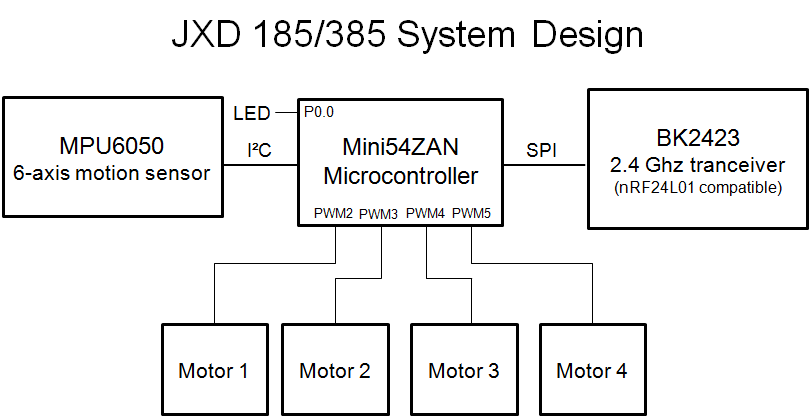
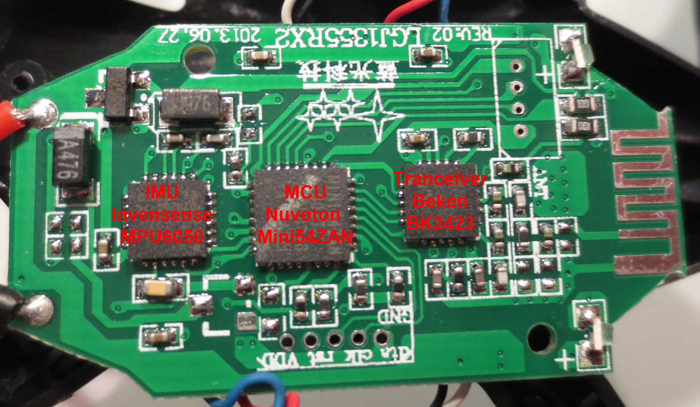

## JXD385 flight controller ##

### PCB ###

### Controller Pin Out ###

	Pin GPIO    Secondary       External connection
	1   P1.5    AIN5            Sense for Motor 4, but not populated on PCB
	2   reset                   SWD Port reset
	3   P3.0    AIN6            NC
	4   P5.4                    NC
	5   P3.1    AIN7            Sense for Motor 1, but not populated on PCB
	6   P3.2    INT0            MPU6050, pin 12 (interrupt)
	7   P3.4    SDA             MPU6050, pin 24 (SDA)
	8   P3.5    SCL             MPU6050, pin 23 (SCL)
	9   P3.6    T1X             Connected to test pad
	10  P5.1                    NC
	11  P5.0                    NC
	12  VSS                     GND
	13  P5.2                    Connected to unpopulated circuit part to control rear LEDS
	14  P2.2    PWM0            NC
	15  P2.3    PWM1            NC
	16  P2.4    PWM2            Motor 1 PWM
	17  P2.5    PWM3            Motor 2 PWM
	18  P2.6    PWM4            Motor 3 PWM
	19  P4.6    ICE_CLK (SWD)   SWD Port CLK
	20  P4.7    ICE_DAT (SWD)   SWD Port Dat
	21  P0.7    SPICLK          BK2423 SPI CLK
	22  P0.6    MISO            BK2423 SPI MISO
	23  P0.5    MOSI            BK2423 SPI MOSI
	24  P0.4    PWM5            Motor 4 PWM
	25  P0.1                    BK2434 SPI CSN
	26  P0.0                    Controls LEDs (Low active)
	27  P5.3                    NC
	28  VDD                     3.3V
	29  P1.0    AIN1            Sense for Motor 2, but not populated on PCB
	30  P1.2    RX              UART PORT RX
	31  P1.3    TX              UART PORT TX
	32  P1.4    AIN4            Sense for Motor 3, but not populated on PCB
