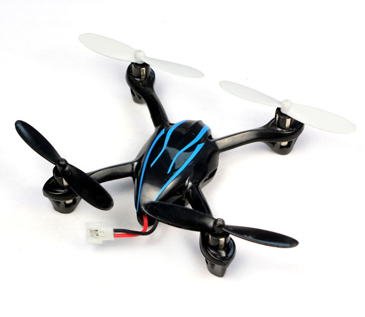

## Hack-O-Copter Documentation ##

The JD185/385 is a cheap quadrocopter that retails for less than 30 EUR including remote control on many websites. You can find it by searching for "6 axis mini UFO". It is a low-cost clone of the popular Hubsan X4.

It was found that the flight controller is build around several standard components: An Invensense MPU6050 IMU, an Cortex-M0 controller and a nRF24l01 compatible tranceiver. This is a very similar hardware configuration to many "hobbyist" -grade quadrocoptors, which are several times more expensive. The microcontroller debug and serial ports are easily accessible on the pcb. If that isn't an invitation to hacking, what else is?

This repository holds the documentation of the reverse engineering work so far.  This information is the result of a community effort in a BBS thread on mikrocontroller.net: [Thread (german)](http://www.mikrocontroller.net/topic/309185)

### Status ###

Completed:

- All relevant components have been identified and documented.
- Circuit diagrams of the flight controller and the remote control have been reconstructed.
- The chip erase sequence to unlock the write protected flight controller has been reverse engineered. It is now possible to flash new firmware with any SWD adapter.
- The remote control protocol was identified (V202) and verified.

Open:

- The original firmware could not be read out due to write protection.
- Reprogramming of the remote control.

----------

http://www.jxdtoys.com/en/detail_A.asp?cpname=385

